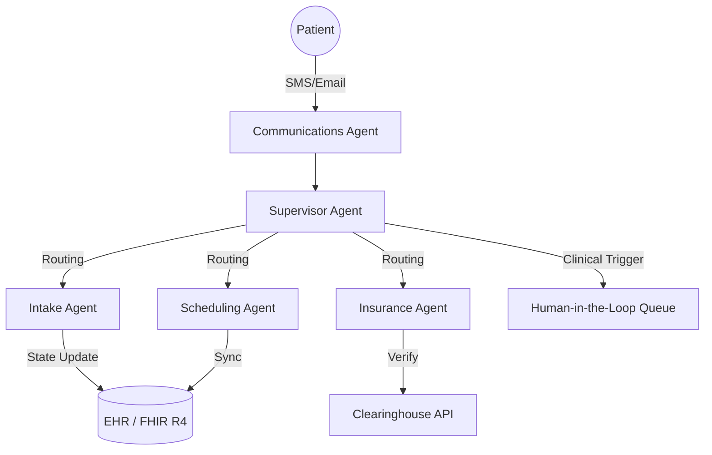

# Helix AI: Enterprise-Grade Autonomous Healthcare CRM Orchestrator

[](https://www.hhs.gov/hipaa/index.html)
[](https://hl7.org/fhir/R4/)
[](https://github.com/langchain-ai/langgraph)
[](https://opensource.org/licenses/MIT)

**Helix AI** is a production-grade, autonomous multi-agent platform designed to automate 80% of front-office and care-coordination tasks for healthcare practices. Built with a **Security-First, HIPAA-Native** architecture, Helix AI manages patient relationships, intake, scheduling, and insurance verification while strictly adhering to clinical boundaries.

---

## 🚀 The Clinical Problem
Healthcare administrative staff are overwhelmed by high-volume, repetitive tasks—scheduling, insurance eligibility checks, and intake documentation. Current solutions are either passive chatbots or rigid RPA tools that lack the clinical reasoning to handle complex workflows or identify emergency "red flags."

## 🧠 The Helix Solution
Helix AI utilizes a **State-of-the-Art Multi-Agent Orchestrator (LangGraph)** where specialized agents handle specific domains under the supervision of a Staff-level reasoning engine.

### Key Autonomous Agents:
*   📅 **Scheduling Agent:** End-to-end EHR synchronization via FHIR R4; manages bookings, cancellations, and no-show risk prediction.
*   📝 **Intake Agent:** Automated patient registration and structured medical history collection with real-time red-flag detection.
*   🛡️ **Insurance Agent:** Real-time eligibility verification via clearinghouse integrations (Change Healthcare) and automated prior-auth drafting.
*   💬 **Communications Agent:** HIPAA-compliant patient engagement (Twilio/Paubox) with a hard-coded clinical content safety perimeter.

---

## 🏗️ Technical Architecture

Helix AI is built on a **Modular Micro-Agent Architecture**:



### Stack Components:
- **Orchestration:** LangGraph (StateGraph) for deterministic & stochastic workflow management.
- **Interoperability:** FHIR R4 (Standardized health data exchange).
- **Compliance Engine:** Custom runtime PHI scoping and Minimum Necessary Access enforcement.
- **Safety Layer:** Real-time clinical boundary detection using multi-shot NLP classification.
- **Database:** PostgreSQL with Row Level Security (RLS) and AES-256 field-level encryption.

---

## 🛡️ Security & Compliance (HIPAA)

Helix AI is designed from the ground up for healthcare security:
1.  **Structural PHI Scoping:** Every agent node only receives a "Minimum Necessary" view of the patient state.
2.  **Clinical Boundary Guardrails:** Every outbound message is scanned for medical advice. Non-operational clinical content is automatically blocked and routed to HITL.
3.  **WORM Audit Trail:** Write-Once-Read-Many audit logs capture every PHI access, classification verdict, and state transition.
4.  **B-A-A Network Protection:** Outbound network requests are restricted to a registry of entities with active Business Associate Agreements (BAA).

---

## 🛠️ Getting Started

### Prerequisites
- Python 3.11+
- [uv](https://github.com/astral-sh/uv) (Recommended for dependency management)

### Installation
```bash
# Clone the repository
git clone https://github.com/jamarius-fortson/health-crm-agent.git
cd health-crm-agent

# Install dependencies
uv sync

# Initialize databases
python -m healthcare_agent.cli init-db
```

### Running the End-to-End Demo
To see the full intake -> insurance -> scheduling flow in action:
```bash
$env:PYTHONPATH = "."; python demos/demo_full_workflow.py
```

---

## 🛣️ Roadmap

- [x] Phase 1-3: Core Compliance Infrastructure & Scheduling Agent
- [x] Phase 4: Intake Agent with Red-Flag Detection
- [x] Phase 5: Insurance Clearinghouse Integration
- [x] Phase 6: Communications Agent with Clinical Content Filtering
- [ ] Phase 7: Care Coordination & Gap Analysis
- [ ] Phase 8: React-based HITL & Administrative Dashboard
- [ ] Phase 9: HL7v2 & X12 Legacy Interoperability Layer

---

## 👥 Contributing
We welcome contributions from healthcare engineers and clinicians. Please read our [CONTRIBUTING.md](CONTRIBUTING.md) and ensure all PRs maintain clinical boundary safety.

## 📄 License
MIT License - see [LICENSE](LICENSE) for details.

---
**Disclaimer:** *Helix AI is a tool to assist healthcare administrative staff. It is not intended for use in self-diagnosis or as a replacement for clinical decision-making by qualified medical professionals.*